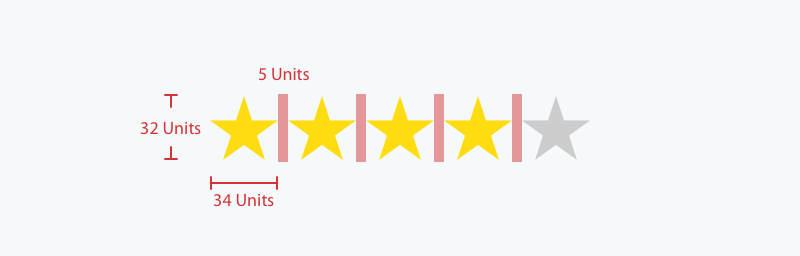

# Review List Challenge

In this challenge you will be asked to setup a single page application to search for shops and display shop reviews.

We don't want you to put too much attention into styling the application - keep it simple, it does not have to look great!

You are welcome implement appropriate automated tests for your tasks.

## Resources Required

#### Reviews API:

- URL: https://reviewsApi.trustedshops.com/rest/internal/v2/shops/{{tsId}}/reviews.json
- Example: https://reviewsApi.trustedshops.com/rest/internal/v2/shops/X6A4AACCD2C75E430381B2E1C4CLASSIC/reviews.json
- [Sample response in case there are issues accessing the URL](samples/shop-search.json)

#### Shop Search API

- URL: https://shop-search-reviewsApi.trustedshops.com/shopsearch?searchTerm={{searchTerm}}&page={{page}}
- Example: https://shop-search-reviewsApi.trustedshops.com/shopsearch?searchTerm=hemden&page=0
- [Sample response in case there are issues accessing the URL](samples/shop-search.json)

#### Star Images
Assets can be found in the [assets folder](assets).
- Full star 
- Empty star 

## Your Tasks

1. Setup a project environment using your preferred SPA framework (e.g. Angular, React, Vue)

1. Call the [Reviews API](#reviews-api) and display the list of reviews in any way you like. Use the shop id (`tsId`) `X6A4AACCD2C75E430381B2E1C4CLASSIC`. Please display: `mark`, `comment`, `creationDate`

    1. Sort the page of reviews by `creationDate` descending

    1. Add a different style to every second review e.g. change text color or background color
  
1. Create a search page, users should be able to search for a shop. The results are provided by the [Shop Search API](#shop-search-api). Display `shopName` and `averageRating`

   1. Allow the user to select a shop from the search results to view the list of reviews you created in the task before

   1. Add three review texts (found in `comment`) provided by the [Reviews API](#reviews-api) for each search result

1. Introduce a review relevance score

   1.	Calculate a review relevance score based on the following rules
      
         ```
           1 Point is added per character of the review, excluding spaces, tab and line breaks – up to 100 points
           50 Points for a full user profile (`firstname` and `lastname` are existing) - e.g. "Hermann Meier"
           25 Points (instead of 50) for a partial profile. `firstname` or `lastname` are one alphabetical character only, e.g. "Hermann M" or "H. M."
         ```
   
   1.	Allow the user to switch from order by `creationDate` to "Order by relevance score descending"

1. Display `mark` and `averageRating` by using stars (0 - 5 full stars). Use the provided [Star Images](#star-images) and design spec:

   
